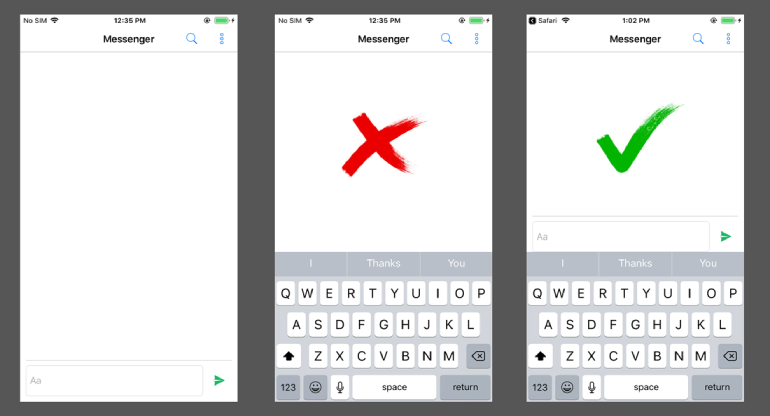

# cordova-plugin-keyboard-scroll

This plugin fixes the keyboard overlaps text input on iOS.



# Installation

From [npm](https://www.npmjs.com/package/cordova-plugin-keyboard) (stable)

`cordova plugin add cordova-plugin-keyboard-scroll`

From github latest (may not be stable)

`cordova plugin add https://github.com/rjurado01/cordova-plugin-keyboard-scroll`

## Preferences

### KeyboardScrollElementID

> An Element ID to the get closest element height size for resizing the web view (ion-tabs by default)

```xml
<preference name="KeyboardScrollElementID" value="ion-tabs" />
```

### KeyboardResizeAfterShow

> Boolean (false by default)

#### Possible values
- `true`: The resizing will happen after the keyboard shows up.
- `false`: Web will be resized before the keyboard shows up.

```xml
<preference name="KeyboardResizeAfterShow" value="true" />
```
